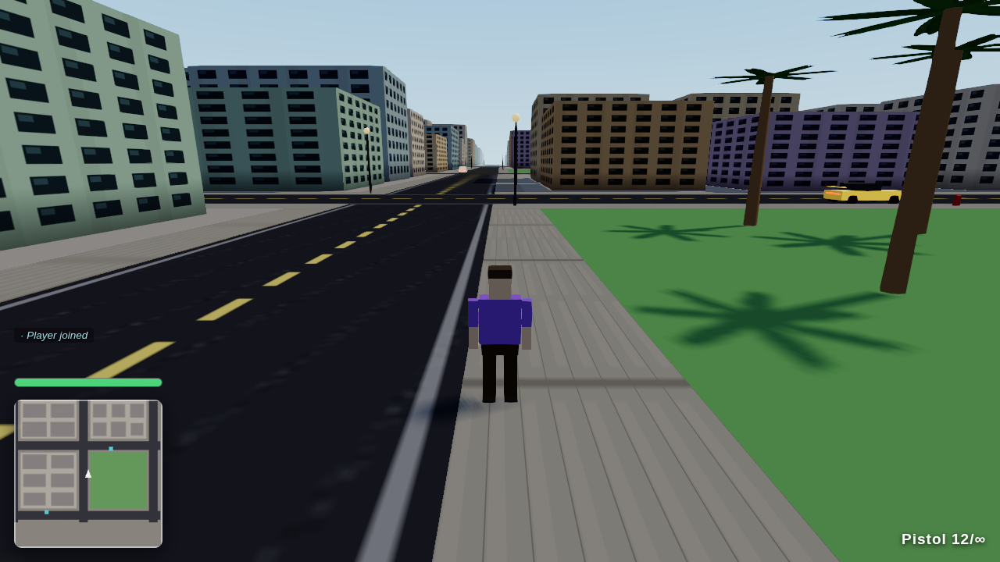
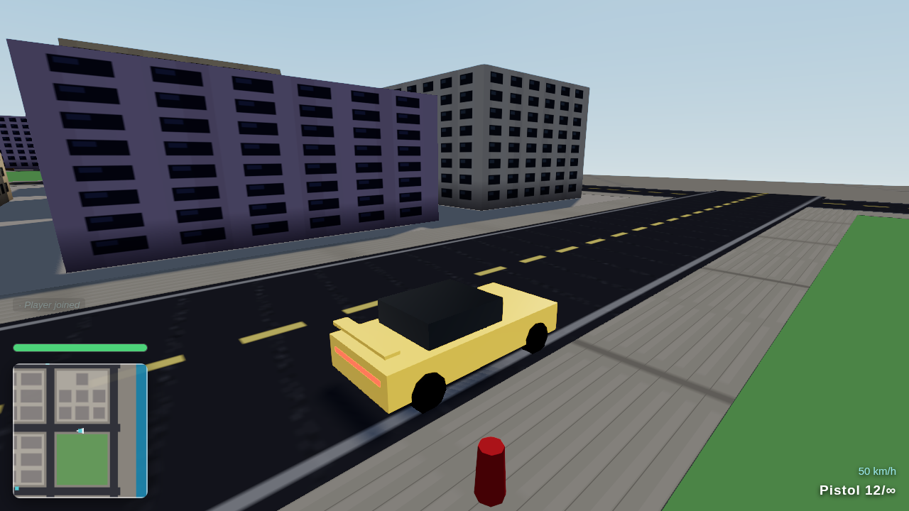
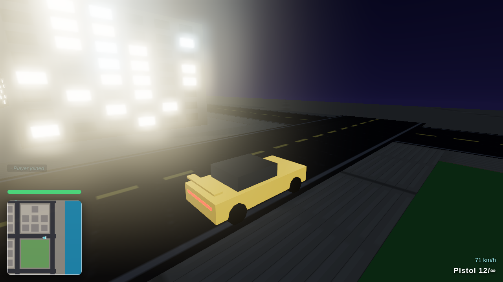

# 🌴 Vice Coast

A **GTA-style open-world multiplayer game that runs entirely in the browser** — inspired by the Vice City fantasy: pastel art-deco blocks, palm-lined beaches, stealable cars, deathmatch chaos and a wanted level when you push your luck too far.

Everything is original and procedural: **zero art assets**. Geometry is built from Three.js primitives + instancing, every texture is painted onto canvases at runtime, and every sound (engines, gunshots, waves) is synthesized with WebAudio.

| | |
|---|---|
|  |  |
|  |  |

_Real-time shadows, bloom-lit neon, filmic tone mapping, a shader sky and ocean — all rendered from procedural geometry, no art assets._

## Play

```bash
npm install
npm run build
npm start          # serves everything on http://localhost:8080
```

Open **http://localhost:8080** in several browser tabs (or send the URL to friends on your network) — everyone shares one persistent city.

### Controls

| key | action | key | action |
|---|---|---|---|
| WASD | move / drive | Shift | sprint |
| Mouse | look (click to lock) | RMB | aim |
| LMB | punch / shoot | 1 / 2 / 3 | fists / pistol / SMG |
| E | enter / exit car | Space | jump / handbrake |
| R | reload | T or Enter | chat |
| Tab | scoreboard | M | mute |

### What's in the sandbox

- **A deterministic procedural city** (~800×640 m): 63 blocks of pastel towers and beachfront hotels, parks, parking lots, a west-coast beach with ocean and palms — generated identically on server and client from one seed (verified with a city hash at connect time).
- **Multiplayer**: WebSocket snapshots at 20 Hz with client prediction and interpolation; server is authoritative over combat, health, scoring, chat and vehicle occupancy, and clamps movement against speed hacks.
- **26+ stealable vehicles** in 4 archetypes (sports, sedan, taxi, pickup) with arcade drift physics, handbrake slides, crash sparks and engine audio pitched by speed. First player to reach a contested car wins it — the server arbitrates.
- **Combat**: pistol, SMG and fists with server-verified hits (cooldown, range, aim-cone, line-of-sight), kill feed, scoreboard, respawns.
- **Living streets**: pedestrians strolling the sidewalks (they ragdoll if you drive through them…) and AI traffic following the road grid.
- **Wanted level**: hurt enough civilians and ★-stars appear — police cruisers hunt you down until you outrun the heat.
- **Day-night cycle** with dusk skies, lit windows and glowing street lamps, synced across all players.
- **Modern rendering**: real-time sun shadows, HDR bloom on neon/lights, ACES filmic tone mapping, a gradient shader sky with a sun disc, an animated fresnel ocean, and glossy image-based-lit car paint. Add `?low` to the URL on a weak machine to drop shadows and bloom.

## Development

```bash
npm run dev        # server on :8080 + Vite dev client on :5173 (proxied /ws)
npm run check      # typecheck all workspaces
npm test           # unit + protocol-bot + browser smoke, in sequence
npm run test:unit  # pure-logic: raycast/collision math, city determinism
npm run test:bot   # protocol bots: car theft, combat, respawn, anti-cheat, police
npm run smoke      # 2 headless browsers join, walk, drive, verify day-night, screenshot
```

### Architecture

```
shared/   protocol types, constants, seeded city generation, collision math
          (no dependencies — the same TS runs on server and client)
server/   Node + ws. 20 Hz authoritative loop: validation, combat, vehicles,
          NPC pedestrians/traffic/police. Serves the built client too.
client/   Vite + Three.js. Rendering (instanced city, ~130 draw calls),
          prediction, interpolation, HUD/minimap/chat, WebAudio synth.
```

One production port: `PORT=8080 npm start` serves the static client and upgrades `/ws` for the game socket.

## Testing

Two end-to-end suites keep it honest:

- **`npm run smoke`** — boots the real server, launches two headless Chromium players (SwiftShader WebGL), and asserts: both join, see each other, movement propagates, a car can be entered and driven, day-night renders, the canvas isn't blank, draw calls stay in budget. Screenshots land in `smoke-artifacts/`.
- **`scripts/bot-test.mjs`** — two protocol-level bots play a full session: steal a car (loser gets `enterDenied`), drive across town, gun each other down, respawn, attempt a teleport hack (clamped), murder a pedestrian, earn a star and get chased by police.

---

Built from scratch as an original homage — no Rockstar assets, names or code.
